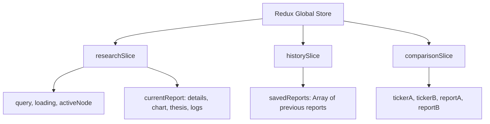

# AI Investment Research Agent — Frontend Plan

This document details the layout, design system, routing architecture, state management system, and individual page specifications for the React frontend of the **AI Investment Research Agent**.

---

## 1. Design Philosophy & Aesthetics

To build a **modern and professional** interface, we will follow premium web design principles:
- **Color Palette (Sophisticated Dark Mode)**:
  - **Background**: Deep obsidian (`#05060b` / `#090a0f`)
  - **Cards & Overlays**: Semitransparent glassmorphism (`rgba(13, 16, 28, 0.7)`) with a subtle `backdrop-filter: blur(12px)` and thin border lines (`rgba(255, 255, 255, 0.05)`)
  - **Accent Colors**: Neon cyan (`#06b6d4` for highlights), Emerald green (`#10b981` for INVEST signals), Vibrant Rose (`#f43f5e` for PASS signals), and Amber (`#f59e0b` for HOLD signals).
- **Typography**: Modern humanist sans-serif fonts such as **Outfit** or **Inter** (loaded via Google Fonts) to convey institutional authority and readability.
- **Micro-Animations**: Framer Motion transitions (fading, layout changes, hover glows, pulsing nodes during agent execution) to make the dashboard feel alive and interactive.

---

## 2. State Management with Redux Toolkit

To keep frontend state centralized and easy to understand, we will implement **Redux Toolkit (RTK)**. 

### Store Architecture
The global store will manage three key slices:



### 1. `researchSlice.ts` (Active Research)
Manages the state of the current running stock analysis.
- **State Structure**:
  ```typescript
  interface ResearchState {
    query: string;
    loading: boolean;
    activeNode: 'IDLE' | 'START' | 'RESOLVE' | 'FETCH_DATA' | 'FETCH_NEWS' | 'ANALYZE' | 'DECIDE' | 'COMPLETED' | 'ERROR';
    logs: Array<{ timestamp: string; stage: string; message: string }>;
    error: string | null;
    report: {
      ticker: string;
      tickerName: string;
      decision: 'INVEST' | 'PASS' | 'HOLD' | null;
      confidence: number;
      targetRange: string;
      investmentThesis: string;
      swot: { strengths: string[]; weaknesses: string[]; opportunities: string[]; threats: string[] } | null;
      news: Array<{ title: string; link: string; publisher: string; sentiment: string; summary: string }>;
      details: any; // P/E, Margins, debt metrics
      chartData: Array<{ date: string; close: number }>;
    } | null;
  }
  ```
- **Key Reducers**:
  - `startResearch(query)`: Resets previous states, sets loading to true, sets activeNode to 'START'.
  - `updateNodeProgress({ node, logs })`: Appends execution logs, updates `activeNode` during Server-Sent Events (SSE) streaming updates.
  - `setResearchResult(report)`: Saves the compiled agentic output and sets loading to false.
  - `setResearchError(error)`: Captures errors and aborts execution.

### 2. `historySlice.ts` (Saved Analyses)
Handles loading and saving reports inside the local storage.
- **State Structure**:
  ```typescript
  interface HistoryState {
    items: Array<HistoryItem>;
  }
  ```
- **Key Reducers**:
  - `loadSavedHistory()`: Loads previously parsed items from `localStorage`.
  - `addReportToHistory(report)`: Prepends a new report, removes duplicates, limits cache capacity to top 10 items, and updates `localStorage`.
  - `removeReportFromHistory(ticker)`: Deletes an analysis record.
  - `clearAllHistory()`: Flushes the entire client cache.

### 3. `comparisonSlice.ts` (Stock Comparison)
Coordinates the optional side-by-side valuation comparison module.
- **State Structure**:
  ```typescript
  interface ComparisonState {
    tickerA: string;
    tickerB: string;
    reportA: HistoryItem | null;
    reportB: HistoryItem | null;
    loadingA: boolean;
    loadingB: boolean;
  }
  ```

---

## 3. Routing Architecture (React Router v6)

We will use **React Router DOM** to split the application into separate, dedicated routes. This structure avoids cluttered single-page architectures and allows bookmarks/direct navigation.

| Route | Page Name | Primary Purpose |
| :--- | :--- | :--- |
| **`/`** | **Landing / Home Page** | Introduce the product, explain the multi-agent system, showcase statistics, and house the main Call-to-Action (CTA). |
| **`/dashboard`** | **Research Workspace** | Perform active queries, display live streaming LangGraph logs, and interact with the full financial decision dashboard. |
| **`/history`** | **Research Library** | Browse, filter, search, and reload previously generated stock analyses from client history. |
| **`/compare`** | **Valuation Comparison** | Select two previously researched companies and compare their metrics (P/E, margins, cash flows) and AI decisions side-by-side. |
| **`/methodology`** | **Agent Architecture** | High-end visual explanation of the backend LangGraph node execution flow. |

---

## 4. Detailed Route Designs & Layouts

### 1. Landing Page (`/`)
* **Objective**: Establish trust and visual wonder. Look institutional-grade and professional.
* **Layout Sections**:
  - **Header Menu**: Logo (InsideIIM Labs), links to Workspace, History, and Methodology, plus a glowing "Launch App" button.
  - **Hero Section**:
    - High-impact headline: *"Automate Equity Valuation with a Multi-Agent AI Analyst"*
    - Subtitle: *"Run deep fundamental, SWOT, and sentiment research on any asset using LangGraph-orchestrated AI pipelines."*
    - **Primary CTA**: A large glowing glass button "Start Stock Analysis" that slides the user to the `/dashboard` route.
  - **Feature Grid**: Three interactive columns showing:
    - *Agentic Pipelines*: Explain the LangGraph node transition steps.
    - *Real-time Data*: Real-time quotes, charts, and news headlines (via Yahoo Finance).
    - *Structured Decisions*: Clean Invest/Pass/Hold verdicts with full institutional markdown reports.
  - **Live Sandbox Indicator**: A visual demo showcase demonstrating a dummy run (e.g. searching "NVDA" triggers a mocked execution flow showing ticker resolve, news extraction, and a verdict).

### 2. Research Workspace Dashboard (`/dashboard`)
* **Objective**: Allow users to run new queries and review the multi-agent analysis.
* **Layout Sections**:
  - **Workspace Header**: Input bar (accepts company names or symbols) with dropdown selector for the LLM model backend (Gemini vs OpenAI GPT).
  - **Loading & Log Stream Grid**: When a search is in progress, the UI displays the `ExecutionTracker` mapping the graph nodes and showing the console-style logs updating in real-time via Server-Sent Events (SSE).
  - **Result Grid (Rendered once completed)**:
    - *Left Card (Recommendation Badge)*: INVEST, PASS, or HOLD verdict, confidence gauge, and current quote stats (Price, % Change, 52W Range).
    - *Center Card (Performance Area Chart)*: interactive Recharts price history toggleable between 30D, 6M, and 1Y.
    - *SWOT Grid*: Four separate grid quadrants showing AI-analyzed corporate Strengths, Weaknesses, Opportunities, and Threats.
    - *Financial Statements Tab*: Sub-tab selectors rendering Income, Balance Sheets, and Cash Flow metrics.
    - *Hedge Fund Memo*: Rich long-form investment thesis rendered from markdown.
    - *News Sentiment*: List of headlines with direct publisher links and sentiment indicators.

### 3. Research Library (`/history`)
* **Objective**: Quick retrieval of past analyses without consuming duplicate LLM API tokens.
* **Layout Sections**:
  - **Header**: Title "Research Library", query search bar, and "Clear Cache" button.
  - **Saved Cards Grid**: Interactive grid. Each card shows:
    - Company Ticker & Long Name.
    - Analysis timestamp.
    - Verdict Badge (Invest/Pass/Hold) and Confidence Rating.
    - Quick ratios peek (P/E and Profit Margins).
    - CTA button: "Open Report" (loads data into the dashboard state and routes to `/dashboard`) and "Delete Record".

### 4. Valuation Comparison (`/compare`)
* **Objective**: Side-by-side benchmarking of key stocks.
* **Layout Sections**:
  - **Selector Header**: Two select menus listing tickers currently saved in history.
  - **Side-by-Side Cards Layout**:
    - Compare decisions: e.g. NVDA (INVEST) vs INTC (PASS) with confidence levels.
    - Metrics Table: Side-by-side benchmark rows (P/E ratio, PEG ratio, operating margins, debt levels).
    - SWOT Contrast: Side-by-side points comparison.
    - Performance Chart: Overlaying both price lines on a single chart to visualize performance divergence.

### 5. Agent Architecture Page (`/methodology`)
* **Objective**: Fulfill the assignment's mandate to demonstrate "how it works under the hood".
* **Layout Sections**:
  - **Visual Graph Diagram**: Interactive flowchart of the backend `StateGraph`. Show the cycle and edges: START $\rightarrow$ resolveTicker $\rightarrow$ fetchData $\rightarrow$ analyzeSentiment $\rightarrow$ analyzeSWOT $\rightarrow$ generateDecision $\rightarrow$ END.
  - **Node Glossary**: Explains what each agent does:
    - *Ticker Resolver*: Re-formats inputs to valid market ticker tickers.
    - *Harvester*: Uses Yahoo Finance API summary profile modules.
    - *Sentiment Scorer*: Classifies news feeds using LLM vectors.
    - *SWOT Evaluator*: Synthesizes statement figures into SWOT matrices.
    - *Decision Solver*: Compiles recommendation matrices and markdown reports.
